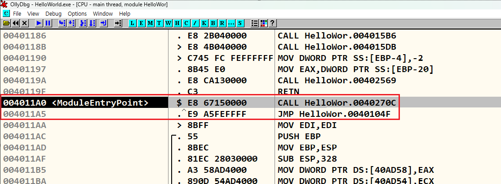

# Hello World! 리버싱
"Hello World!" 프로그램을 디버깅
{: .fs-6 .fw-300 }

---

## 1.0 Hello World! 프로그램
- Visual C++를 이용해 C 언어 HelloWorld.cpp를 빌드
- 소스코드는 Windows API를 사용하여 "Hello World!"가 담긴 MessageBox 출력
- HelloWorld.cpp 빌드 후, 실행 파일(HelloWorld.exe) 생성


```cpp
#include "windows.h"
#include "tchar.h"

int _tmain(int argc, TCHAR* argv[])
{
	MessageBox(NULL,
		L"Hello World!",
        L"Bite98",
		MB_OK)
		;
	return 0;
}
```

## 1.1 HelloWorld.exe 디버깅
- HelloWorld.exe 파일을 OllyDbg로 열기

{: .note-title }
> **OllyDbg**는 Windows 환경에서 동작하는 **디버거(Debugger)**로, 주로 어셈블리 언어 수준에서 프로그램의 실행을 분석하는 데 사용
> [OllyDbg](https://www.ollydbg.de/)

- 디버거가 멈춘 곳은 EP(EntryPoint) 코드로, HelloWorld.exe의 실행 시작 주소
- 시작 주소는 **7FFA_399AC087**, JMP, SHORT 명령어가 존재



## 1.2 프로그램 구성 요소
- Address(**7FFA_399AC087**) : 프로세스의 가상 메모리(Virtual Address:VA) 내의 주소
- Instruction(**EB 00**) : IA32(또는 x86) CPU 명령어
- Disassembled code(**JMP SHORT 7FFA_399AC087**) : OP Code를 보기 쉽게 어셈블리로 변환한 코드
- comment : 디버거에서 추가한 주석

{: .note-title }
> **EP**란 Windows 실행 파일(EXE, DLL, SYS 등)의 코드 시작점을 의미, 프로그램이 실행될때 CPU에 의해 가장 먼저 실행되는 코드 시작 위치


- 실행 파일을 디버깅(Debugging)하여 어셈블리 언어로 변환 된 main() 함수 찾기


---
