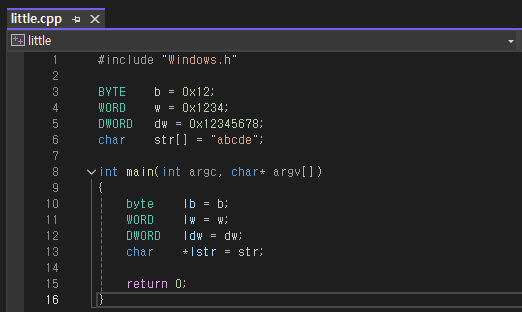
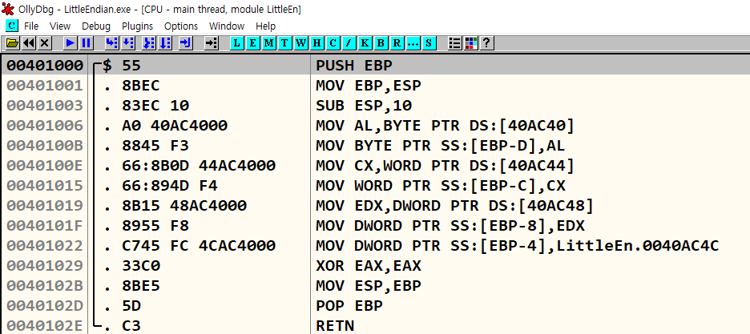

# 리틀 엔디언 표기법
{: .no_toc}

바이트 오더링(Byte Ordering)에 대하여 실습
{: .fs-6 .fw-300 }

---

1. TOC
{:toc}

---

## 실습 목표
- 총 4개의 (크기가 다른) 자료이 엔디언 방식에 따라서 같은 데이터를 각각 어떤 식으로 저장하는지 비교

---

## 1.1 바이트 오더링
- 바이트 오더링은 컴퓨터 메모리에서 데이터를 저장하고 읽는 방식에 대한 개념
- 바이트 오더링 방식에는 크게 두 가지가 존재 (빅 엔디언(Big Endian), 리틀 엔디언(Little Endian))
- 엔디언(Endian)은 **바이트 오더(Byte Ordering)**을 의미

{: .no_toc}
> **빅 엔디언(Big Endian)**은 가장 큰 바이트가 먼저 오는 방식이다. 즉 데이터의 최상위 바이트(Most Significant Byte, NSB)가 가장 작은 메모리 주소에 저장
> **리틀 엔디언(Little Endian)**은 가장 작은 바이트가 먼저 오는 방식이다. 즉, 데이터의 최하위(Least Significant Byte, LSB)가 가장 작은 메모리 주소에 저장

## 1.2 빅 엔디언과 리틀 엔디언의 차이점
- 총 4개의 (크기가 다른) 자료형이 존재
- 

 

- 각 엔디언 방식에 따라서 같은 데이터를 각각 어떤 식으로 저장하는지 아래 표로 비교

| TYPE       | NAME  | SIZE  | Big Endian Style                    | Little Endian Style                 |
|------------|-------|-------|-------------------------------------|-------------------------------------|
| BYTE       | b     | 1     | [12]                                | [12]                                |
| WORD       | w     | 2     | [12][34]                            | [34][12]                            |
| DWORD      | dw    | 4     | [12][34][56][78]                    | [78][56][34][12]                    |
| char []    | str   | 6     | [61][62][63][64][65][00]            | [61][62][63][64][65][00]            |

{: .no_toc}
> - 바이트(BYTE) 타입의 b 변수를 저장할 때는 두 방식의 차이가 없다. 하지만 2바이트 이상의 크기를 가진 자료형을 저장할 때부터 차이가 나타남
> - ASCII 문자열 마지막은 NULL로 끝이 남

## 1.3 빅 엔디언
- 빅 엔디언은 대형 UNIX 서버에 사용되는 RISC 계열의 CPU에서 많이 사용
- 네트워크 프로토콜에서는 대부분 빅 엔디언 방식을 사용, 이를 종종 **네트워크 바이트 오더**라고도 불림
- 빅 엔디언은 큰 값(상위 바이트)이 먼저 오기 때문에 사람이 숫자를 읽는 방식과 동일
- 이러한 점 때문에 네트워크에서 데이터를 송수신할 때, 숫자를 직관적으로 해석하는 데 용이
- 또한 다양한 아키텍처 간에 데이터를 주고받을 때 사람이 데이터를 쉽게 이해할 수 있는 구조가 유리하게 작용

{: .no_toc}
> - **RISC 계열의 CPU**는 고성능과 안정성을 요구하는 시스템에서 주로 사용되는 프로세서 아키텍처이다.
> - 여기서 말하는 큰 값(상위 바이트), 작은 값(하위 바이트)는 **크기 차이**가 아니라, **바이트가 메모리나 데이터 내에서 어떤 순서에 위치하느냐**를 나타내는 용어

## 1.4 리틀 엔디언
- 리틀 엔디언은 주로 멀티 바이트 데이터를 처리할 때 사용
- 리틀 엔디언은 x86 아키텍처를 사용하는 대부분의 PC와 서버에서 널리 사용되는 방식으로, 메모리에서 데이터가 어떻게 배열되는지를 결정하는 중요한 개념
- 리틀 엔디언 방식에서는 메모리의 작은 주소에 데이터의 하위 바이트가 먼저 저장
- 리틀 엔디언 방식은 가변 길이 데이터를 처리할 때 유리하다. 프로세서가 16비트, 32비트, 64비트 크기의 데이터를 다룰 때 작은 단위의 데이터부터 차레를 읽을 수 있어 효율적이다.

{: .no_toc}
> - 32비트 아키텍처는 CPU가 한 번에 처리할 수 있는 데이터의 단위가 32비트라는 것을 의미
> - 32비트는 4바이트(8비트 = 1바이트)로 구성되며, CPU가 한 번에 처리할 수 있는 레지스터의 크기가 32비트라는 뜻
> - 64비트 아키텍처는 CPU가 한 번에 64비트(8바이트) 크기의 데이터를 처리
> - x86 아키텍처는 인텔이 개발한 CISC(Complex Instruction Set Computing) 기반의 CPU 아키텍처
> - x86 아키텍처는 주로 32비트 아키텍처를 의미하지만, 현대의 x86 CPU 대부분 x86-64(x64) 아키텍처로 64비트를 지원

## 1.5 OllyDbg에서 리틀 엔디언 확인
- 아래 코드를 빌드하여 LittleEndian.exe를 생성한 후 OllyDbg로 디버깅
- 

 

- Go to 명령[Ctrl+G]으로 401000 주소로 이동
- main() 함수의 주소는 401000이고, 전역 변수들의 주소는 404AC40(b), 40AC44(w), 40AC48(dw), 40AC4C(str) 이다.
- 

 

- OllyDbg의 데이터 창에서 Go to 명령을 통해 40AC40 주소로 이동
- 변수 w와 dw 값들이 리틀 엔디언 형식으로 저장된 것을 확인
- 

---

> [OllyDbg](https://www.ollydbg.de/)

