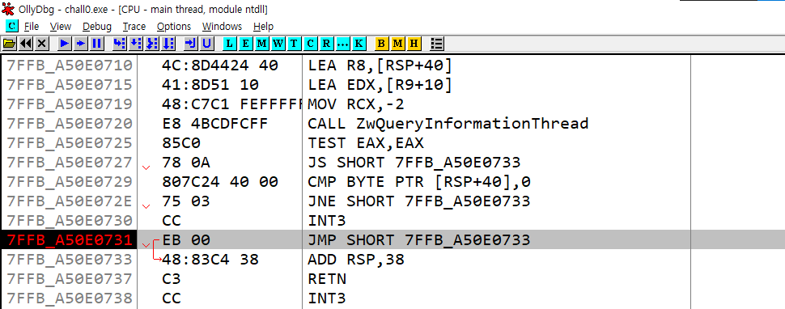
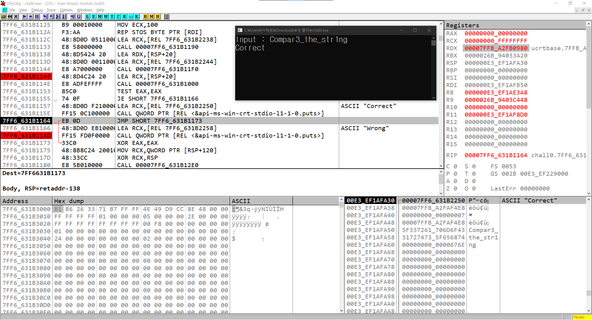

# Wargame - 01
{: .no_toc}

Reversing Basic Challenge #0
{: .fs-6 .fw-300 }

[Dreanhack][dreamhack]{: .btn .fs-5 .mb-4 .mb-md-0 target="_blank"}

---

1. TOC
{:toc}

---

## 문제
- 사용자에게 문자열 입력을 받아 정해진 방법으로 입력값을 검증하여 correct 또는 wrong을 출력하는 프로그램이 주어집니다.
- 해당 바이너리를 분석하여 correct를 출력하는 입력값을 찾으세요!

## 도구
- OllyDbg 64-bit

{: .no_toc}
> - 디버깅 작업을 여러 날에 걸쳐 진행한 관계로, 메모리 주소 값이 이전 작업과 달라질 수 있습니다.
> - 디버깅 도구를 사용하여 프로그램을 분석할 때, 재실행 시 메모리 주소가 재배치되거나 변동될 수 있는 점을 감안 부탁드립니다.

---

## 1.1 문제 해결 전략 
- 디버깅 시작 전 프로그램 파일을 실행시켜 확인
- 사용자에게 문자열 입력을 받는 함수의 주소 확인
- 입력받는 문자열 저장 주소 확인
- Wrong, Correct 출력 함수 확인
- Wrong, Correct 출력 함수 디버깅
- Wrong, Correct 조건문 함수 확인
- Correct 입력값 도출

---
## 2.1 프로그램 파일 실행
- 먼저 **OllyDbg**를 사용하여 프로그램을 실행
- 프로그램 파일을 실행하여 기본 동작을 확인
- 프로그램이 시자되면 사용자 입력을 받기 위해 Input() 함수를 호출
- 사용자가 값을 입력한 후, "Wrong" 메시지가 출력
- 

## 2.2 사용자에게 문자열 입력을 받는 함수의 주소 확인
- 프로그램을 재디버깅 하여 시작주소로 이동
- 

<br>

- Step Over`[F8]` 명령어를 사용해 CMD 창에서 Input 함수가 호출될 때까지 디버깅을 진행.
- **CALL 00007FFB_6DF79B2C** : Input 함수와 관련된 주소인 7FFB_6DF79B2C를 확인.
- 


## 2.3 입력받는 문자열 저장 주소 확인
- Input 함수가 실행되었으나 입력이 불가능한 상태였으며, 입력이 가능할 때까지 디버깅(`[F8]`)을 계속 진행.
- SYSCALL 명령어가 실행된 후에 사용자 입력이 가능해졌고, 입력 후 디버깅을 계속 진행
- 

## 2.4 Wrong, Correct 출력 함수 확인
- 해당 어셈블리 코드 확인
- `LEA, RCX, [RSP+20]` : **현재 스택 포인터(RSP)**에 **0x20(32 바이트)**를 더한 메모리 주소를 **RCX**에 저장
- `TEST EAX, EAX` : 비트 AND 연산을 수행하여 EAX 레지스터의 값을 검사
- `JE SHORT 7FF6_03D111166` : 위의 TEST 결과가 0이면 ZF 플래그가 설정되어 있는 메모리 주소(7FF6_03D111166)로 이동
- 아래 **Correct**, **Wrong** ASCII 문자열을 확인
- 

{: .no_toc}
> - RSP : 스택 포인터를 의미하며, 현재 스택의 최상단
> - RCX : 일반적인 연산에서 데이터를 임시로 저장하거나 값을 계산하는 데 사용할 수 있는 범용 레지스터
> - [RSP+20] : 스택에서 RSP + 0x20(32바이트) 위치에 있는 데이터
> - TEST는 EAX와 EAX를 테스트하는 것이므로, EAX 값 자체가 0인지 여부를 검사
> - EAX == 0 : ZF(Zero Flag)가 설정
> - EAX != 0 : ZF가 클리어
> - TEST 결과에 따라 JE 결과가 0이 아니면 ZF 플래그가 클리어되어 JE 명령어를 무시,
> - 결과가 0이면 JE가 지정된 메모리 주소로 이동

<br>

- `TEST EAX, EAX` 결과에 따라 "Correct", "Wrong"이 출력
- 따라서 CALL 00007FF6_03D11000 에서 EAX 값이 결정
- Step Into(`[F7]`) 명령어를 사용해 `CALL 7FF6_03D11000` 명령어가 호출하는 해당 메모리 주소로 이동

## 2.5 Wrong, Correct 출력 함수 디버깅
- 해당 어셈블리 코드 확인
- `MOV QWORD PTR [RSP+8], RCX` : RCX에 저장된 64비트 값을 [RSP+8] 스택에 저장
- 현재 RCX 범용 레지스터에는 사용자가 입력한 'TEST' 문자열이 저장되어 있음
- `LEA RDX, [REL 7FF6_03D12220]` : **Compar3_the_str1ng**(7FF6_03D12220)를 RDX에 저장
- `MOV RCX, QWORD PTR [RPS+40]` : RSP + 0x40 위치에 있는 64비트 데이터를 읽고, RCX에 저장
- 

{: .no_toc}
> - MOV : 데이터를 복사하는 명령어
> - RDX : 64비트 범용 레지스터
> - REL : 상대 주소(Relative Address)를 의미, 현재 명령어의 위치를 기준으로 한 상대적인 메모리 주소
> - PTR : 특정 크기의 데이터를 처리할 때 사용, 이는 메모리에서 읽거나 쓸 데이터의 크기를 결정하는 데 중요
> - BYTE PTR : 1바이트(8비트) 크기의 데이터
> - WORD PTR : 2바이트(16비트) 크기의 데이터
> - DWORD PTR : 4바이트(32비트) 크기의 데이터
> - QWORD PTR : 8바이트(64비트) 크기의 데이터

<br>

- 아래에 `CALL <JMP.&api-ms-win-crt-string-l1-1-0.strcmp>` 명령어 확인
- **<JMP.&api-ms-win-crt-string-l1-1-0.strcmp>**는 문자열 비교 함수인 `strcmp`를 호출하는 명령어
- Step Into 명령어를 사용해 `CALL <JMP.&api-ms-win-crt-string-l1-1-0.strcmp>` 명령어 실행
- CALL 명령어를 실행하면 7FF6_B3241EB8 주소로 이동
- Step Into 명령어를 사용해 `JMP QWORD PTR [REL <&api-ms-win-crt-string-l1-1-0.strcmp>` 명렁어 실행
- 

{: .no_toc}
> - 디버깅 작업을 여러 날에 걸쳐 진행한 관계로, 메모리 주소 값이 이전 작업과 달라짐

<br>

- 명령어를 실행하고 나면, 7FFB_6DF85630 주소로 이동
- 해당 어셈블리 코드 확인
- SUB RDX, RCX : RDX, RCX 두 레지스터 간의 주소 차이를 계산
- 현재 RCX Registers 값 : 000000A0_FE35FB10 (ASCII "TEST")
- `TEST CL, 07` : RCX의 하위 8비트 부분과 0x07(16진수) 연산자에 대해 비트 AND 연산을 수행
- TEST 결과값에 따라 `JE SHORT 7FFB_6DF8564C` 실행
- 

{: .no_toc}
> - RCX : 000000A0_FE35FB10 (ASCII "TEST")
> - CL(RCX의 하위 8비트) : 0x10(이진수 : 0001 0000)
> - 07 : 0x07 (이진수: 0000 0111)
> - 따라서 CL, 07 AND 연산 결과 **0000 0000**, 즉 Zero Flag가 실행

<br> 

- ZF가 실행되어 7FFB_6DF8564C 주소로 이동 후, Step Over 명령어 실행
- 해당 어셈블리 코드 확인
- `SUB RDX, RCX` : RDX, RCX 두 레지스터 간의 주소 차이를 계산
- `TEST CL, 07` : 연산 결과 **0000 0000**
- `JE SHORT 7FFB_6DF8564C` : 테스트 결과에 따라 7FFB_6DF8568C 주소로 이동
- 

<br>

- 7FFB_6DF8564C 주소로 이동 후, Step Into 명령어 실행
- `AND EAX, 00000FFF` : EAX와 00000FFF 연산 후, EAX는 0x0220
- `CMP EAX, OFF8` : EAX와 0x0FF8 값을 비교
- `JA SHORT 7FFB_6DF85638` : CMP 비교 결과, EAX 값이 더 작기 때문에 CF가 설정되고, ZF는 클리어
- 하지만 `JA SHORT`는 CF, ZF가 모두 클리어된 경우에만 점프, 따라서 점프하지 않고 다음 명령어 실행
- `CMP RAX,QWORD PTR [RCX+RDX]` : CMP 비교 결과, RAX 값이 더 크기 때문에 CF, ZF가 클리어
- `JA SHORT 7FFB_6DF85638` : CMP 결과에 따라 해당 주소로 점프
- 

{: .no_toc}
> - EAX는 RAX의 하위 32비트이므로, EAX 값은 B3242220 이다.
> - CMP destination, source : 두 값을 비교하는 어셈블리 명령어, 결과는 버리고 오직 플래그만 갱신
> - destination < source: CF = 1 (설정됨, 빌림 발생)
> - destination ≥ source: CF = 0 (클리어됨, 빌림 없음)
> - destination == source: ZF = 1 (설정됨, 값이 같음)
> - destination ≠ source: ZF = 0 (클리어됨, 값이 다름)
> - destination < source (부호 있는 연산에서 음수): SF = 1 (설정됨, 음수 결과)
> - destination ≥ source (부호 있는 연산에서 양수 또는 0): SF = 0 (클리어됨, 양수 결과)

<br>

- 7FFB_6DF85638 주소로 이동 후, Step Into 명령어 실행
- 명령어 실행 후, `CMP AL, BYTE PTR [RCX]` : CMP 비교 결과, AL 값과 RCX 값이 같지 않기 때문에, ZF가 클리어
- `JNE SHORT 7FF8_6DF8568F` : CMP 결과에 따라, 7FF8_6DF8568F 주소로 점프
- 

{: .no_toc}
> - JE : Zero Flag가 설정된 경우에만 점프
> - JNE : Zero Flag가 클리어된 경우에만 점프

<br>

- 7FF8_6DF8568F 주소로 이동 후, 해당 어셈블리 코드 확인
- `SBB RAX, RAX` : RAX에서 RAX를 빼고, 이전 `Carry Flag`에 따라 RAX 값을 결정
- 이전 CF 값은 `CMP AL, BYTE PTR [RCX]` 결과로, CF가 0이기 때문에 RAX 값은 0이다.
- `OR RAX, 1` : RAX 값을 최소 1로 설정 (이미 -1인 경우 그대로 유지)
- 

{: .no_toc}
> - SBB RAX, RAX는 이전 명령어의 CF 값에 의존
> - CF = 0이면: RAX = RAX - RAX - 0 = 0
> - CF = 1이면: RAX = RAX - RAX - 1 = -1
> - JNE : Zero Flag가 클리어된 경우에만 점프

<br>

- RETN 명령어 실행 후, 이전에 호출된 CALL <JMP.&api-ms-win-crt-string-l1-1-0.strcmp> 함수에서 빠져나옴
- `JNE SHORT 7FF6_B3241028` : 위의 TEST 결과로 인해 ZF가 1로 설정, 따라서 7FF6_B3241028로 점프

- 

<br>

- 해당 함수에서 빠져나와 `JE SHORT 7FF6_B3241166` 명령어 실행
- Step Over 명령어를 사용하여 디버깅을 계속함.
- 00007FF6_03D11173 주소에서 "Wrong" 문자열이 출력됨.
- 

<br>

- strcmp 함수 예시

```c
#include <stdio.h>
#include <string.h>

int main() {
	char str1[] = "shw";
	char str2[] = "0331";
	char str3[] = "shw";

	int result1 = strcmp(str1, str2);
	int result2 = strcmp(str2, str3);
	int result3 = strcmp(str1, str3);

	printf("result1 : %d \n", result1);
	printf("result2 : %d \n", result2);
	printf("result3 : %d \n", result3);

	return 0;
}
// 출력값 (사전순으로 뒤에 있으면 1, 사전순으로 앞에 있으면 -1, 같으면 0)
// result1 : 1
// result2 : -1
// result3 : 0
```

---

---

[dreamhack]: https://dreamhack.io/wargame/challenges/14