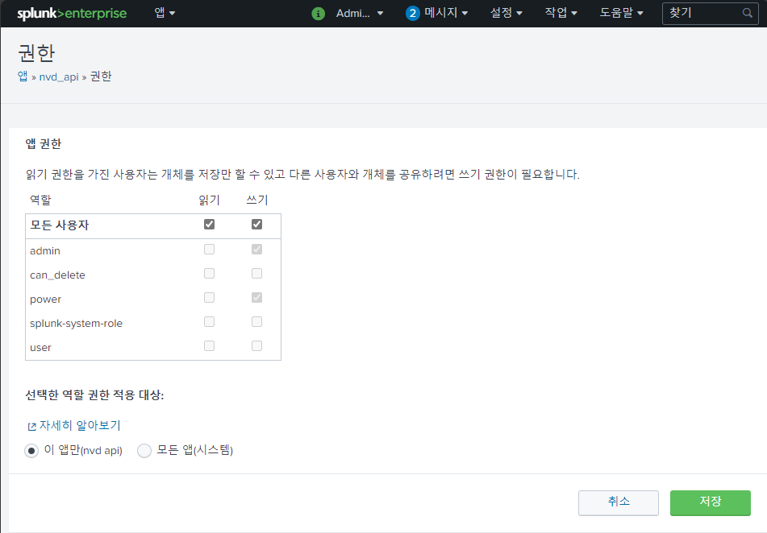
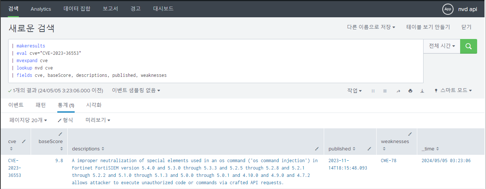
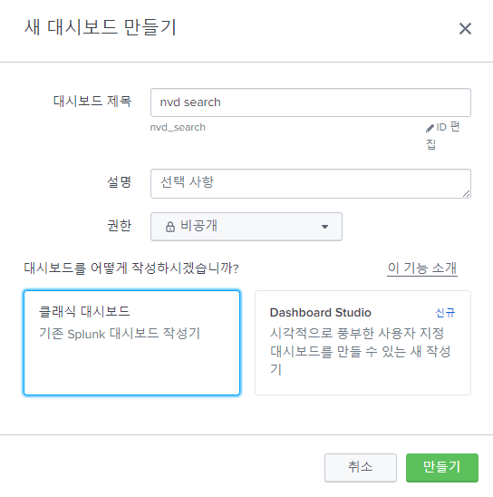

# lookup
{: .no_toc }
    
Splunk의 공식 문서를 참고하여 작성되었습니다.
{: .fs-6 .fw-300 }

[lookup Docs][Splunk lookup search Docs]{: .btn .fs-5 .mb-4 .mb-md-0 }
[external lookup Docs][Splunk external lookup Docs]{: .btn .fs-5 .mb-4 .mb-md-0 }

1. TOC
{:toc}

---

## lookup 정의
Splunk에서 외부 데이터를 가져와 검색 결과에 추가 정보를 제공하거나 변환하는 기능      
    
## lookup 유형
- CSV lookup : CSV 파일에서 데이터를 가져옴
- External lookup : 외부 시스템이나 데이터 소스에서 데이터를 가져옴
- KV Store lookup : Key-Value 스토어를 사용하여 동적 데이터를 검색하고 기존 데이터와 통합
- Geospatlal lookup : 지리적 위치 정보를 기반으로하는 lookup 기능으로, 지도 시각화 및 지리 정보에 대한 분석에 활용
    
## lookup 실습
Python Script를 사용하여 데이터를 수집하고, external lookup 기능을 활용하여 Splunk 형식으로 변환한 후 사용자에게 정보를 제공하는 Splunk 애플리케이션을 개발

{: .note-title }
> **External lookup**을 사용하면  웹 사이트, 데이터베이스, API 등에서 데이터를 가져올 수 있습니다. Script를 통해 데이터를 가져오면 실시간으로 사용자에게 최신 정보를 제공할 수 있습니다.

- 버전 : Splunk 8.2.7 
- 유형 : External lookup
- 언어 : Python
- 환경 : Windows
- 내용 : NVD API를 활용하여 CVE 데이터를 수집하고, 이를 Splunk 사용자에게 제공

---
## Step1: Splunk App 생성
- Splunk에서 앱을 생성하기 위해 Splunk 인터페이스에서 **"앱"**을 선택
- **"앱 만들기"**를 클릭하여 앱을 생성


## Step2: App 권한 설정
- Python Script를 실행하기 위해 해당 앱에 대한 권한을 설정
- 모든 사용자 읽기, 쓰기 권한 부여


## Step3: Python Script 생성
- NVD API 공식 문서를 참고하였습니다.
- [NVD API Docs][nvd api Docs]{: .btn .fs-3 .mb-4 .mb-md-0 }
- 경로 : {Splunk 설치 경로}/Splunk/etc/apps/nvd_api/bin/
- 파일 : **nvd.py** 생성
- field : cve, published, descriptions, baseScore, weaknesses

### import Statements
{: .no_toc }
```py
import csv
import sys
import json
import requests
```

### main 함수
{: .no_toc }
```py
def main():
    # Splunk field 값은 총 5개로 지정 : cve, published, descriptions, baseScore, weaknesses
    # 명령어를 포함하여 field 값이 6개가 아닐 경우 예외처리
    if len(sys.argv) != 6:
        print("Usage: python external_lookup.py [cve field] [published field] [descriptions field] [baseScore field] [weaknesses field]")
        sys.exit(1)

    # 해당 field값에 사용자로부터 입력받은 field값 저장
    cvefield = sys.argv[1]
    publishedfield = sys.argv[2]
    descriptionsfield = sys.argv[3]
    baseScorefield = sys.argv[4]
    weaknessesfield = sys.argv[5]

    # STDIN 입력 스트림을 사용하여 검색 결과로부터 입력 데이터를 읽고,
    # STDOUT 출력 스트림을 사용하여 조회 데이터를 검색 파이프라인에 반환
    infile = sys.stdin
    outfile = sys.stdout

    # 입력 및 출력 데이터를 CSV 테이블로 변환, 
    # 이때 field 이름이 테이블 헤더로 사용.
    r = csv.DictReader(infile)
    header = r.fieldnames
    w = csv.DictWriter(outfile, fieldnames=header)
    w.writeheader()

    # cvefield 값을 기반으로 데이터를 조회하고,
    # 조회된 데이터를 각 field 값에 저장
    for result in r:
        if result[cvefield]: 
            search = lookup(result[cvefield])
            result[publishedfield] = data_nvd[0]
            result[descriptionsfield] = data_nvd[1]
            result[baseScorefield] = data_nvd[2]
            result[weaknessesfield] = data_nvd[3]
            w.writerow(result)
            
data_nvd = ["None"] * 4
main()
```

### nvd api 함수
{: .no_toc }
```py
def lookup(cve):
    try:
        # 사용자로부터 입력받은 CVE를 바탕으로 NVD API 요청
        nvd_url = "https://services.nvd.nist.gov/rest/json/cves/2.0"
        api_key = "your_api_key" # NVD API key

        search_url = nvd_url + "?cveId=" + cve
        headers = {
            "api_key": api_key
        }
        
        response = requests.get(search_url, headers=headers)
        data_req = response.text

        # NVD data를 json 형식으로 load
        json_data = json.loads(data_req)

        # NVD json data에서 field 값 저장
        published = json_data['vulnerabilities'][0]['cve']['published']
        data_nvd[0] = (published if published else "None")
        
        descriptions = json_data['vulnerabilities'][0]['cve']['descriptions'][0]['value']
        data_nvd[1] = (descriptions if descriptions else "None")

        baseScore = None
        source = json_data['vulnerabilities'][0]['cve']['metrics']['cvssMetricV31'][0]['source']
        if source == 'nvd@nist.gov':
            baseScore = json_data['vulnerabilities'][0]['cve']['metrics']['cvssMetricV31'][0]['cvssData']['baseScore']
            data_nvd[2] = (baseScore if baseScore else "None")
        else:
            data_nvd[2] = ("None")
            
        weaknesses = json_data['vulnerabilities'][0]['cve']['weaknesses'][0]['description'][0]['value']
        data_nvd[3] = (weaknesses if weaknesses else "None")

    except:
        return []
```

## Step4: transforms 생성
- NVD 데이터를 splunk에 맞게 변환하기 위한 설정 파일
- 경로 : {Splunk 설치 경로}/Splunk/etc/apps/nvd_api/default/
- 파일 : **transforms.conf** 생성
- 파일 생성 후 **Splunk 서버 재시작**

### transforms.conf
{: .no_toc }
```conf
[nvd]
external_cmd = nvd.py cve published descriptions baseScore weaknesses
fields_list = cve published descriptions baseScore weaknesses
python.version = python3
```

## Step5: 조회
- Splunk nvd cve query
- 예시 cve : CVE-2023-36553

{: .warning }
> NVD API를 요청할 때, 입력된 CVE 번호가 소문자로 제공되면 오류가 발생합니다. 따라서 모든 CVE 번호를 대문자로 변환하여 조회해야 합니다.

```md
| makeresults
| eval cve="CVE-2023-36553"
| lookup nvd cve
| fields cve, baseScore, descriptions, published, weaknesses
```


## Step6: Dashboard 생성
- 해당 앱의 인터페이스에서 **"대시보드"**를 선택
- **"새 대시보드 만들기"**를 클릭하여 생성 후, **"클래식 대시보드"** 선택


### 대시보드 편집 (원본)
{: .no_toc }
```xml
<form theme="dark">
  <label>CVE 검색 대시보드 / - / NVD API</label>
  <description>SHW0331</description>
  <fieldset submitButton="true" autoRun="false">
    <input type="text" token="cve_token" searchWhenChanged="true">
      <default>CVE-2024-1252</default>
      <label>cve_id</label>
    </input>
  </fieldset>
  <row>
    <panel>
      <title>NVD SEARCH</title>
      <table>
        <search>
          <query>
| makeresults 
| eval cve="$cve_token$" 
| mvexpand cve 
| lookup nvd cve 
| fields cve, baseScore, descriptions, published, weaknesses
          </query>
          <earliest></earliest>
          <latest></latest>
        </search>
        <option name="count">10</option>
        <option name="dataOverlayMode">none</option>
        <option name="drilldown">none</option>
        <option name="refresh.display">progressbar</option>
        <option name="rowNumbers">false</option>
        <option name="wrap">true</option>
      </table>
    </panel>
  </row>
</form>
```


---
[Splunk lookup search Docs]: https://dev.splunk.com/enterprise/search/?q=lookup
[Splunk external lookup Docs]: https://dev.splunk.com/enterprise/tutorials/module_externallookup/planthelookup/

[nvd api Docs]: https://nvd.nist.gov/developers/vulnerabilities